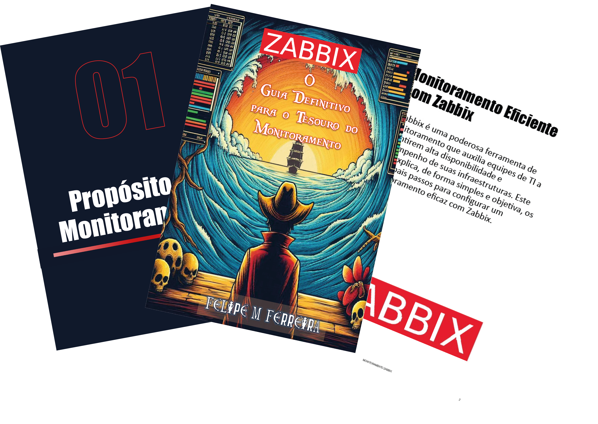

    

-------

# Projeto EBOOK Gerado por I.A.s

 > ℹ️ **NOTE:** Este é o repositório desenvolvido durante o curso no qual fui aluno na plataforma da [DIO](https://dio.me)

Projeto com o objetivo de gerar um ebook digital com as facilidades das ferramentas de IA. todos os prompts
seguem abaixo.

<a href="https://github.com/felipeb2a/prompt_test/blob/main/output/ebook-monitoramento-zabbix.pdf" title="View PDF now"> 📕Clique aqui para ler</a>

## 💻 Tecnologias utilizadas no projeto

- [ChatGPT](https://chat.openai.com/) 
- [MidJourney](https://www.midjourney.com/app/)
- [PowerPoint](https://www.microsoft.com/en/microsoft-365/powerpoint)

## 🧠 Prompts

ChatGPT：

|   Ação   | prompt                                                                                                                                                                                                                                                                         |
| :------: | ------------------------------------------------------------------------------------------------------------------------------------------------------------------------------------------------------------------------------------------------------------------------------ |
|  título  | Crie um titulo de um ebook, sobre o tema zabbix, o ebook é do nicho de Infraestrutura de TI e o subnicho é monitoramento, o titulo deve ser épico e curto, tenha uma temática mais nerd, tenha uma temática do anime onepiece, me liste 5 variações de títulos.                                                        |
| conteúdo | Me escreva um ebook sobre o assunto de zabbix, aonde explica os principais passos para se obter um bom monitoramento de uma infraestrutura. {REGRAS} Explique sempre de uma maneira simples, Deixe o texto enxuto, Sempre traga exemplos de contextos reais, Sempre deixe um título sugestivo por tópico. |

Midjourney：

|  Ação  | prompt                                                                                 |
| :----: | -------------------------------------------------------------------------------------- |
| título | Create an image with a pirate looking at a horizon in one piece style, with a sea of information possibilities in the zabbix monitoring style |

## ✨ Features

- Conteúdo gerado via ChatGPT
- Imagens geradas via MidJourney

## 📚 Materiais

- Imagens utilizadas em `assets`
- ebook gerado durante as aulas em `output`

## 🛠️ Instruções de execução

Utilize os prompts acima nas ferramentas sugeridas para gerar o material base e utilize uma ferramenta de edição de documentos como power point, libreoffice , indesign para diagramação.

## 👨‍💻 Expert

    
    
&nbsp&nbsp&nbspFelipe M Ferreira 
    &nbsp&nbsp&nbsp
    <a href="https://github.com/felipeb2a">
    GitHub</a>&nbsp;|&nbsp;
    <a href="https://www.linkedin.com/in/felipe-marques-ti/">LinkedIn</a>
&nbsp;|&nbsp;
    <a href="https://www.instagram.com/felipeb2a/">
    Instagram</a>
&nbsp;|&nbsp;

  

---

⌨️ com 💜 por [Felipe M Ferreira](https://github.com/felipeb2a)